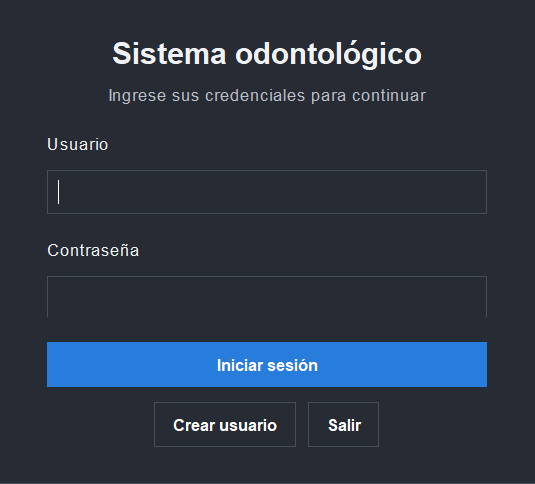
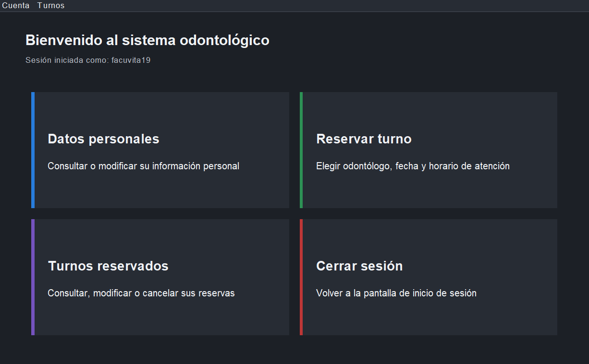
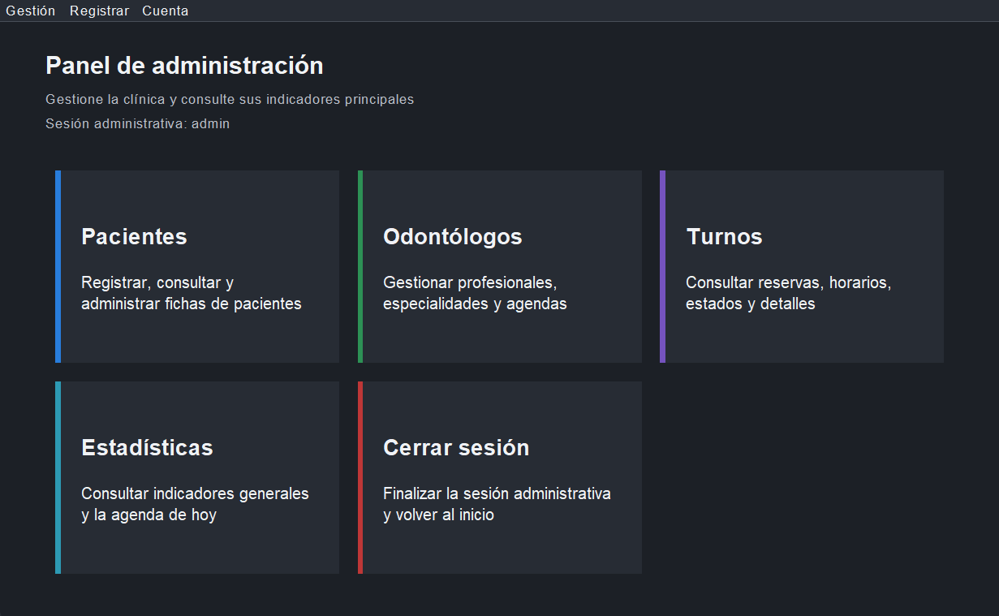
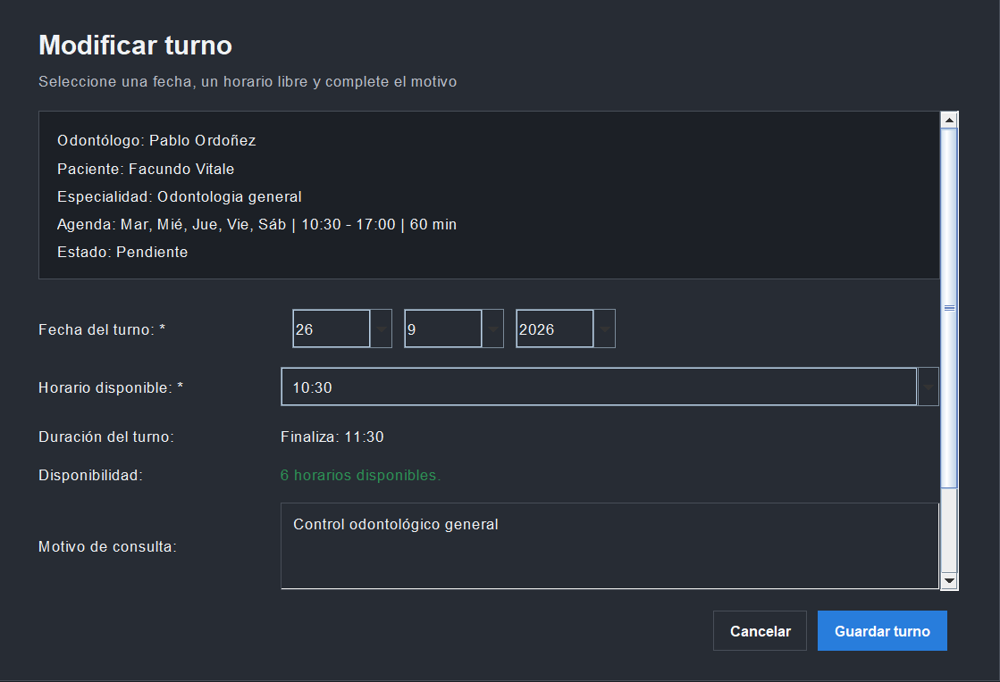
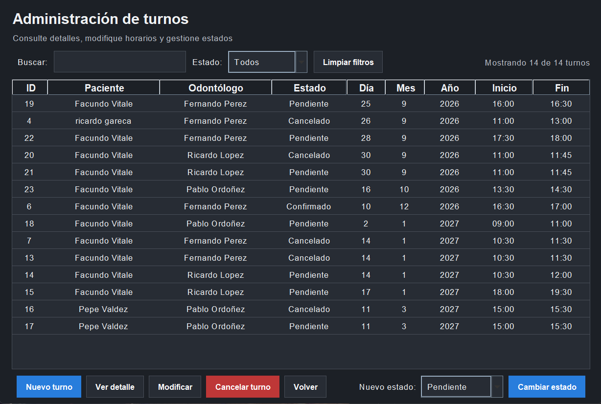
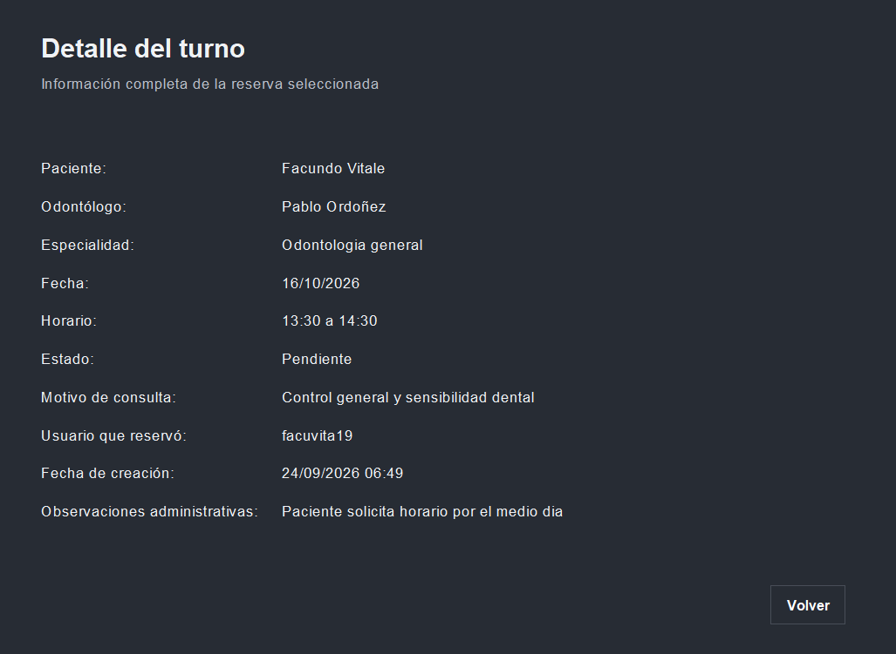
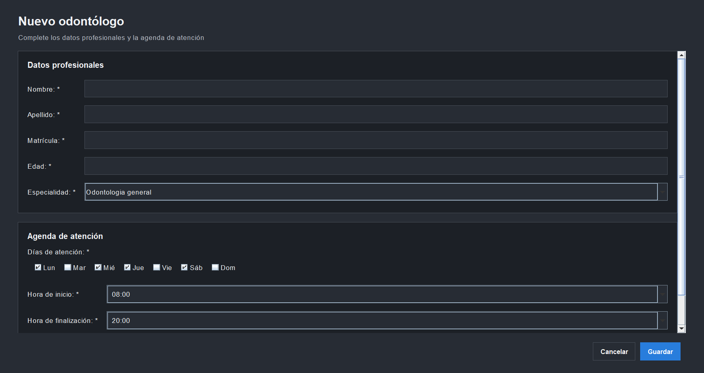
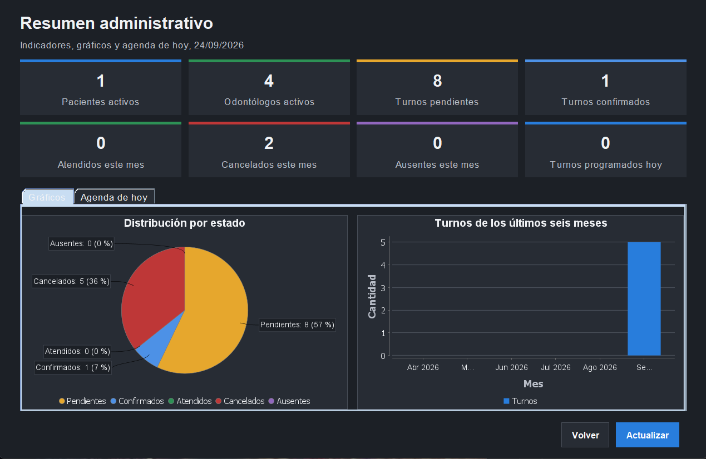

# Sistema de Gestión Odontológica

Aplicación de escritorio desarrollada con Java Swing para gestionar pacientes, odontólogos, usuarios y turnos de una clínica odontológica.

El sistema incorpora autenticación por roles, agenda laboral configurable, cálculo automático de horarios disponibles, seguimiento del estado de los turnos, estadísticas administrativas, gráficos y persistencia en MySQL mediante JDBC.

## Características principales

### Usuarios y seguridad

- Registro de cuentas de usuario.
- Inicio de sesión con roles de administrador y usuario.
- Contraseñas protegidas mediante PBKDF2 y salt.
- Nombre de usuario único.
- Vinculación entre una cuenta común y su ficha de paciente.
- Credenciales de MySQL externas al código fuente.
- Consultas parametrizadas mediante `PreparedStatement`.

### Pacientes

- Alta y modificación de fichas.
- DNI único.
- Fecha de alta.
- Sección de datos personales para usuarios comunes.
- Búsqueda por nombre, apellido, DNI o domicilio.
- Desactivación lógica para conservar el historial.

### Odontólogos

- Alta y modificación de profesionales.
- Matrícula única.
- Especialidades configurables:
  - Odontología general.
  - Ortodoncia.
  - Endodoncia.
  - Cirugía.
  - Odontopediatría.
  - Periodoncia.
  - Prótesis.
- Selección de días de atención.
- Configuración de hora de inicio y finalización.
- Duración habitual del turno.
- Búsqueda por nombre, apellido, matrícula o especialidad.
- Desactivación lógica para conservar turnos históricos.

### Turnos

- Reserva mediante selección de odontólogo.
- Selección manual de paciente para administradores.
- Asignación automática del paciente para usuarios comunes.
- Selección de fecha mediante controles seguros.
- Cálculo automático de horarios libres.
- Respeto por los días y la jornada laboral del odontólogo.
- Hora final calculada según la duración configurada.
- Prevención de fechas y horas pasadas.
- Prevención de horarios superpuestos.
- Horarios consecutivos permitidos.
- Reutilización de horarios pertenecientes a turnos cancelados.
- Motivo de consulta visible para el paciente y el administrador.
- Observaciones administrativas privadas.
- Pantalla de detalle del turno.
- Estados disponibles:
  - Pendiente.
  - Confirmado.
  - Atendido.
  - Cancelado.
  - Ausente.
- Búsqueda, filtros y ordenamiento en los listados.

### Estadísticas administrativas

- Cantidad de pacientes activos.
- Cantidad de odontólogos activos.
- Turnos pendientes y confirmados.
- Turnos atendidos, cancelados y ausentes durante el mes actual.
- Turnos programados para el día.
- Agenda diaria en formato de tabla.
- Gráfico de distribución de turnos por estado.
- Gráfico de turnos programados durante los últimos seis meses.

### Interfaz

- Interfaz gráfica desarrollada con Java Swing.
- Diseño visual centralizado mediante `EstilosUI`.
- Navegación diferenciada por rol.
- Tablas ordenables y adaptables al tamaño de la ventana.
- Búsquedas instantáneas y contadores de resultados.
- Formularios con validaciones y navegación por teclado.
- Acceso al detalle mediante botón, doble clic o Enter.
- Diseño oscuro consistente.

## Capturas de pantalla

> Las capturas deben guardarse en `docs/images/` con los nombres indicados a continuación.

### Inicio de sesión



### Panel del usuario



### Panel administrativo



### Reserva de turno



### Administración de turnos



### Detalle del turno



### Agenda de odontólogos



### Estadísticas y gráficos



## Tecnologías utilizadas

- Java 17.
- Java Swing.
- Maven.
- JDBC.
- MySQL.
- MySQL Connector/J.
- JFreeChart.
- JUnit 5.
- Maven Surefire Plugin.
- Maven Shade Plugin.
- Git y GitHub.
- Eclipse IDE.

## Arquitectura

La aplicación utiliza una arquitectura en capas:

```text
Vista Swing
    |
    v
Servicios y reglas de negocio
    |
    v
Interfaces DAO
    |
    v
Implementaciones DAO para MySQL
    |
    v
Base de datos MySQL
```

Esta organización separa la interfaz, las reglas de negocio y la persistencia. Los servicios pueden probarse mediante implementaciones dobles de los DAO sin necesidad de conectarse a MySQL.

## Estructura del proyecto

```text
app-odontologos/
├── database/
│   ├── migrations/
│   │   ├── 01_agenda_odontologos.sql
│   │   └── 02_detalle_turnos.sql
│   └── schema.sql
├── docs/
│   └── images/
├── src/
│   ├── main/
│   │   ├── java/
│   │   │   ├── config/
│   │   │   ├── dao/
│   │   │   ├── negocio/
│   │   │   ├── servicio/
│   │   │   ├── util/
│   │   │   └── vista/
│   │   └── resources/
│   │       └── images/
│   └── test/
│       └── java/
│           └── servicio/
├── database.properties.example
├── pom.xml
└── README.md
```

## Requisitos

Antes de ejecutar el proyecto se necesita:

- JDK 17 o superior.
- MySQL Server.
- Maven instalado o integrado en el IDE.
- Una base MySQL accesible desde la computadora.

## Instalación

### 1. Clonar el repositorio

```bash
git clone https://github.com/facuvita19/app-odontologos.git
cd app-odontologos
```

### 2. Crear la base de datos

Abrir MySQL Workbench y ejecutar:

```text
database/schema.sql
```

El script crea la base:

```text
clinica_odontologica
```

Y las tablas:

```text
pacientes
odontologos
odontologo_dias_atencion
usuarios
turnos
```

### 3. Configurar la conexión local

Copiar:

```text
database.properties.example
```

con el nombre:

```text
database.properties
```

Completar la configuración local:

```properties
db.url=jdbc:mysql://localhost:3306/clinica_odontologica?serverTimezone=America/Argentina/Buenos_Aires&useSSL=false
db.user=root
db.password=PASSWORD_LOCAL
```

`database.properties` contiene credenciales privadas y no debe subirse al repositorio.

### 4. Configurar el administrador

Después de crear las tablas, ejecutar una vez:

```text
config.ConfigurarAdministrador
```

La utilidad solicita una contraseña y crea o actualiza la cuenta administrativa utilizando el mecanismo seguro de contraseñas del proyecto.

Luego se puede ingresar con:

```text
Usuario: admin
Contraseña: contraseña configurada localmente
```

## Ejecución desde Eclipse

1. Importar el proyecto como proyecto Maven existente.
2. Esperar la descarga de dependencias.
3. Crear `database.properties` a partir del archivo de ejemplo.
4. Ejecutar `database/schema.sql` en MySQL para una instalación nueva.
5. Ejecutar `config.ConfigurarAdministrador` una vez.
6. Ejecutar `vista.ClasePrincipal` como Java Application.

## Pruebas automáticas

El proyecto cuenta con 40 pruebas unitarias para los servicios de pacientes, odontólogos y turnos.

Las pruebas verifican, entre otros casos:

- Campos obligatorios.
- DNI y matrícula duplicados.
- Edades válidas.
- Normalización de datos.
- Agenda laboral de odontólogos.
- Horarios fuera de jornada.
- Duración habitual de turnos.
- Superposiciones.
- Horarios disponibles.
- Transiciones y bloqueos de estados.

Ejecutar todas las pruebas:

```bash
mvn clean test
```

Resultado esperado:

```text
Tests run: 40
Failures: 0
Errors: 0
Skipped: 0
BUILD SUCCESS
```

Las pruebas utilizan DAO dobles en memoria y no requieren una conexión a MySQL.

## Generación del JAR ejecutable

Ejecutar:

```bash
mvn clean package
```

Maven ejecutará primero las pruebas. Si todas finalizan correctamente, generará:

```text
target/app-odontologos.jar
```

El JAR incluye las dependencias necesarias gracias a Maven Shade Plugin.

Para iniciarlo:

```bash
java -jar target/app-odontologos.jar
```

`database.properties` debe encontrarse en el directorio de trabajo desde el que se inicia la aplicación.

## Distribución para Windows

Una distribución local puede organizarse así:

```text
App Odontologos Ejecutable/
├── Iniciar App Odontologos.bat
├── app-odontologos.jar
├── database.properties
├── database.properties.example
└── README.md
```

Ejemplo de iniciador:

```bat
@echo off
cd /d "%~dp0"

where javaw >nul 2>&1

if errorlevel 1 (
    echo No se encontro Java en el sistema.
    echo Instale Java 17 o agregue Java al PATH.
    pause
    exit /b 1
)

start "" javaw -jar app-odontologos.jar
```

El archivo real `database.properties` no debe incluirse en una distribución pública.

## Migraciones

Para instalaciones existentes se incluyen:

```text
database/migrations/01_agenda_odontologos.sql
database/migrations/02_detalle_turnos.sql
```

- `01_agenda_odontologos.sql` agrega especialidades, horarios, duración y días de atención.
- `02_detalle_turnos.sql` agrega el motivo de consulta y complementa el detalle de los turnos.

Para instalaciones nuevas debe utilizarse directamente:

```text
database/schema.sql
```

## Seguridad

- Las contraseñas no se almacenan como texto legible.
- Se utiliza PBKDF2 con salt.
- Las credenciales de MySQL están fuera del código fuente.
- `database.properties` está excluido del repositorio.
- Las consultas utilizan `PreparedStatement`.
- Los usuarios comunes solo pueden acceder a sus propios turnos.
- Las observaciones administrativas no se muestran a usuarios comunes.
- La eliminación lógica conserva el historial clínico y administrativo.

## Archivos locales excluidos

Los siguientes archivos y carpetas no deben versionarse:

```text
database.properties
target/
bin/
App Odontologos Ejecutable/
*.class
```

Los archivos de texto de la versión anterior basada en serialización pueden conservarse únicamente como respaldo local:

```text
pacientes.txt
odontologos.txt
usuarios.txt
turnos.txt
```

## Flujo de construcción recomendado

```text
mvn clean test
mvn clean package
Probar app-odontologos.jar
Commit
Push
```

## Próximas mejoras

- Incorporar capturas definitivas del sistema.
- Agregar diagrama de arquitectura.
- Agregar diagrama entidad relación.
- Configurar integración continua con GitHub Actions.
- Preparar una distribución pública versionada.
- Publicar la primera release estable.

## Autor

Facundo Vitale
