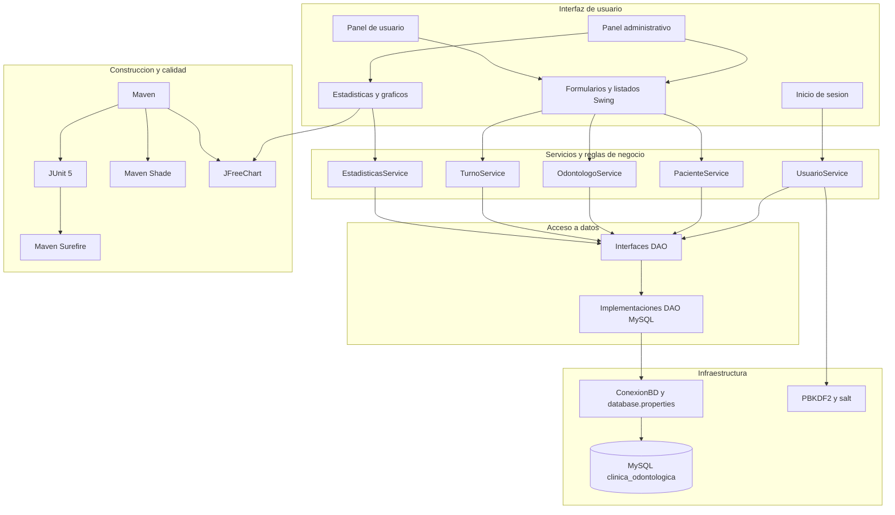

# Arquitectura del sistema

Este documento describe la arquitectura general del Sistema de Gestion Odontologica y la responsabilidad de cada capa.

## Diagrama de arquitectura

## Responsabilidades por capa

### Vista

La capa `vista` contiene los paneles, formularios, tablas y componentes desarrollados con Java Swing. Esta capa presenta la informacion y delega las operaciones en los servicios.

### Servicios

La capa `servicio` concentra las reglas de negocio y las validaciones, entre ellas:

- Validacion de pacientes y odontologos.
- Agenda laboral de profesionales.
- Calculo de horarios disponibles.
- Prevencion de superposiciones.
- Validacion de transiciones de estado.
- Proteccion del acceso a turnos por usuario.

### DAO

La capa `dao` define interfaces de persistencia e implementaciones para MySQL. Las consultas utilizan `PreparedStatement` y mantienen separada la logica SQL de la interfaz grafica.

### Negocio

La capa `negocio` contiene los modelos y enumeraciones del dominio, como pacientes, odontologos, turnos, especialidades y estados.

### Configuracion y seguridad

- `ConexionBD` obtiene la configuracion desde `database.properties`.
- Las credenciales no se incluyen en el repositorio.
- Las contrasenas se protegen mediante PBKDF2 y salt.

### Construccion y pruebas

- Maven administra dependencias y construccion.
- JUnit 5 ejecuta las pruebas unitarias.
- Maven Surefire integra las pruebas con el ciclo de construccion.
- Maven Shade genera un JAR ejecutable con dependencias.
- JFreeChart genera los graficos administrativos.
