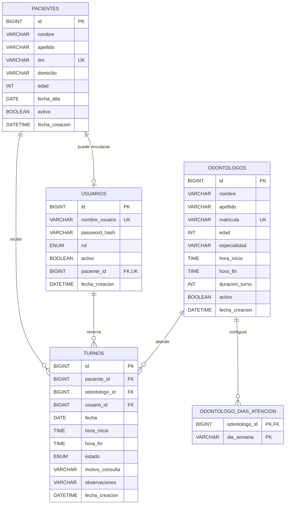

# Modelo de datos

Este documento presenta las entidades principales y las relaciones de la base de datos `clinica_odontologica`.

## Diagrama entidad relacion

## Relaciones principales

### Pacientes y usuarios

Un paciente puede estar vinculado con una cuenta de usuario. Los administradores pueden tener `paciente_id` nulo. La restriccion unica evita que dos cuentas se vinculen con la misma ficha.

### Pacientes y turnos

Un paciente puede poseer varios turnos. La clave foranea conserva la integridad del historial.

### Usuarios y turnos

Cada turno registra el usuario que realizo la reserva. Esto permite distinguir la ficha del paciente de la cuenta que ejecuto la operacion.

### Odontologos y turnos

Cada turno pertenece a un odontologo. La disponibilidad se valida mediante fecha, hora de inicio, hora de finalizacion y estado.

### Odontologos y dias de atencion

La tabla `odontologo_dias_atencion` representa una relacion de uno a muchos entre un profesional y sus dias laborales. La clave primaria compuesta evita dias duplicados.

## Reglas de integridad destacadas

- DNI de paciente unico.
- Matricula de odontologo unica.
- Nombre de usuario unico.
- Un paciente puede vincularse con una sola cuenta.
- Hora de finalizacion posterior a la hora de inicio.
- Duracion de turno del odontologo entre 15 y 180 minutos.
- Duracion de turno multiplo de 15 minutos.
- Dias de atencion limitados a los valores de `DayOfWeek`.
- Estados de turno limitados a Pendiente, Confirmado, Atendido, Cancelado y Ausente.
- Sin indice unico de horario, porque las superposiciones se validan por intervalos y los horarios cancelados pueden reutilizarse.

## Archivos relacionados

- `database/schema.sql`: esquema completo para instalaciones nuevas.
- `database/migrations/01_agenda_odontologos.sql`: agenda para instalaciones existentes.
- `database/migrations/02_detalle_turnos.sql`: motivo y detalle para instalaciones existentes.
